# 정보 구조도

이 문서는 옷장난감 서비스의 화면, 메뉴, 주요 진입 흐름을 기능 기준으로 정리합니다. 상세 FE 라우팅과 컴포넌트 구조는 FE 레포 문서를 따르며, 이 문서는 FE/BE가 같은 기능 범위를 이해하기 위한 기준으로 사용합니다.

## 문서 기준

- 화면 이름과 기능 흐름은 [기획서](../planning/project-plan.md), [요구사항 정의서](../requirements/requirements-definition.md), [기능 인덱스](../requirements/feature-index.md)를 기준으로 정리합니다.
- API 경로나 FE 컴포넌트명보다 사용자가 보는 기능 흐름을 우선합니다.
- FE 실제 라우트와 화면 파일 위치는 FE 레포 문서에서 상세화합니다.

## 화면 영역

| 영역 | 주요 기능 |
| --- | --- |
| 랜딩/인증 | 서비스 소개, 로그인, 소셜 OAuth, 온보딩 |
| 홈/추천 | OOTD, 취향 기반 추천, 유사 상품, 어울리는 옷, AI MD 추천, 추천 상세 |
| 옷장 | 보유 옷, 미보유 옷, 통계, 상세, 수정, 즐겨찾기, 삭제, 보유 전환 |
| 옷 등록 | 사진 기반 등록, 구매내역 캡처 등록, 외부 상품 저장 |
| 룩피드 | 피드 목록, 피드 상세, 작성, 좋아요, 댓글, 저장 |
| 마이페이지 | 내 정보 확인/수정, 룩피드 프로필 확인/편집, 소셜 계정, 외부 링크, 약관/도움말, 로그아웃, 회원 탈퇴 |
| 오류 화면 | 서버 오류, 네트워크 오류, 404 |

## 다이어그램

```mermaid
flowchart TD
  Landing["랜딩 / 서비스 소개"]
  Login["로그인"]
  OAuth["소셜 OAuth 로그인"]
  Onboarding["온보딩"]
  App["메인 앱"]

  Landing --> Login
  Login --> OAuth
  OAuth --> Onboarding
  OAuth --> App
  Onboarding --> App

  App --> Home["홈 / 추천"]
  App --> Closet["옷장"]
  App --> Feed["룩피드"]
  App --> Profile["마이페이지"]

  Home --> OOTD["오늘의 코디 추천"]
  Home --> StyleReco["취향 기반 추천"]
  Home --> SimilarReco["유사 상품 추천"]
  Home --> MatchReco["어울리는 옷 추천"]
  Home --> AiMd["AI MD 추천"]
  Home --> RecoDetail["추천 상세"]

  RecoDetail --> SaveWishlist["미보유 옷 저장"]
  RecoDetail --> Feedback["저장 / 싫어요 / 추천 제외"]
  RecoDetail --> ConvertOwned["구매 후 보유 전환"]

  Closet --> ClosetSummary["옷장 요약 / 통계"]
  Closet --> OwnedList["보유 옷 목록"]
  Closet --> WishlistList["미보유 옷 목록"]
  Closet --> ClothesDetail["옷 상세"]
  Closet --> Register["옷 등록"]

  Register --> PhotoRegister["사진 기반 등록"]
  Register --> PurchaseRegister["구매내역 캡처 등록"]
  Register --> ExternalRegister["외부 상품 저장"]

  ClothesDetail --> ClothesEdit["옷 수정"]
  ClothesDetail --> Favorite["즐겨찾기"]
  ClothesDetail --> RemoveFromWardrobe["옷장에서 삭제"]

  Feed --> FeedList["룩피드 목록"]
  Feed --> FeedDetail["피드 상세"]
  Feed --> FeedWrite["피드 작성"]
  Feed --> FeedAction["좋아요 / 댓글 / 저장"]

  Profile --> BasicInfoEdit["기본 정보 수정"]
  Profile --> StylePreferenceEdit["선호 스타일 수정"]
  Profile --> LookfeedProfile["룩피드 프로필"]
  LookfeedProfile --> LookfeedProfileEdit["룩피드 프로필 편집"]
  Profile --> SocialAccount["소셜 계정"]
  LookfeedProfileEdit --> ExternalLinks["외부 링크"]
  Profile --> TermsHelp["약관 / 도움말"]
  Profile --> Logout["로그아웃"]
  BasicInfoEdit --> Withdraw["회원 탈퇴"]

  App --> ErrorServer["서버 오류 화면"]
  App --> ErrorNetwork["네트워크 오류 화면"]
  App --> NotFound["404 화면"]

  classDef auth fill:#4338ca,stroke:#a5b4fc,color:#fff;
  classDef main fill:#047857,stroke:#6ee7b7,color:#fff;
  classDef detail fill:#9a3412,stroke:#fdba74,color:#fff;
  classDef sub fill:#404040,stroke:#a3a3a3,color:#fff;

  class Landing,Login,OAuth,Onboarding auth;
  class App,Home,Closet,Feed,Profile main;
  class OOTD,StyleReco,SimilarReco,MatchReco,AiMd,RecoDetail,Register,ClothesDetail,FeedDetail,FeedWrite,BasicInfoEdit,StylePreferenceEdit,LookfeedProfile,LookfeedProfileEdit detail;
  class SaveWishlist,Feedback,ConvertOwned,ClosetSummary,OwnedList,WishlistList,PhotoRegister,PurchaseRegister,ExternalRegister,ClothesEdit,Favorite,RemoveFromWardrobe,FeedList,FeedAction,SocialAccount,ExternalLinks,TermsHelp,Logout,Withdraw,ErrorServer,ErrorNetwork,NotFound sub;
```

## 변경 기준

- MVP 화면 범위, 메뉴명, 추천 탭, 옷장 탭, 피드 흐름이 바뀌면 이 문서를 함께 수정합니다.
- FE 실제 라우팅이 바뀌면 FE 레포의 라우팅 문서와 함께 정합성을 확인합니다.
- 기능 ID나 요구사항 범위가 바뀌면 [요구사항 정의서](../requirements/requirements-definition.md)와 [기능 인덱스](../requirements/feature-index.md)를 먼저 수정합니다.
