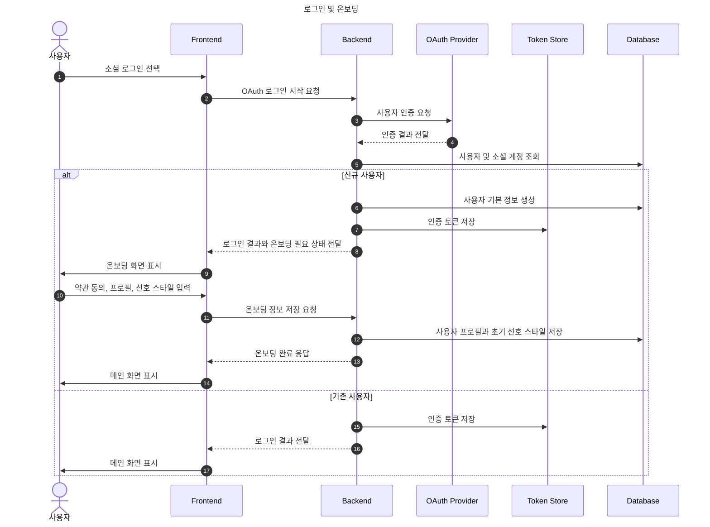
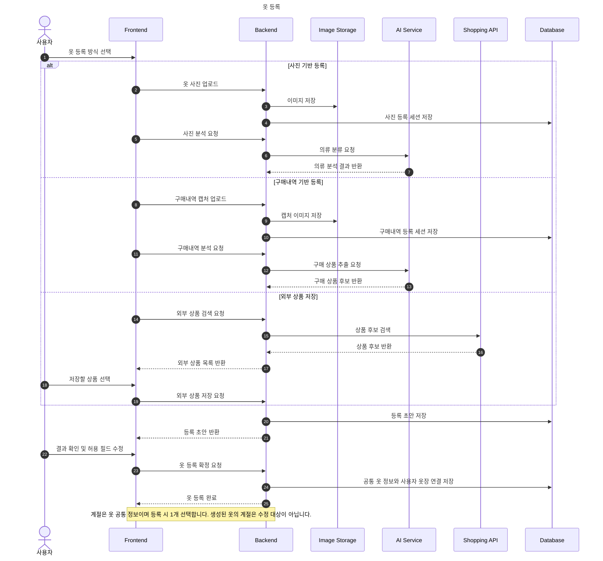
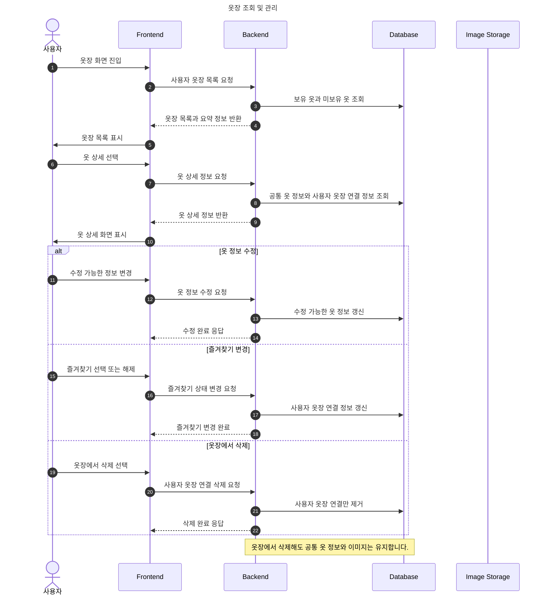
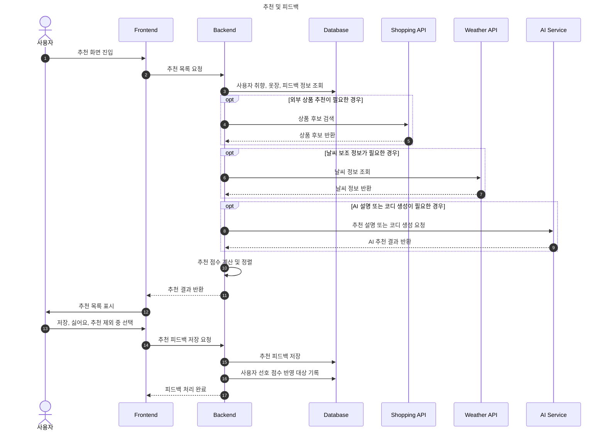
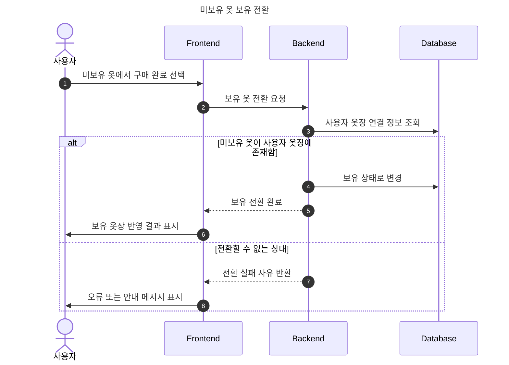
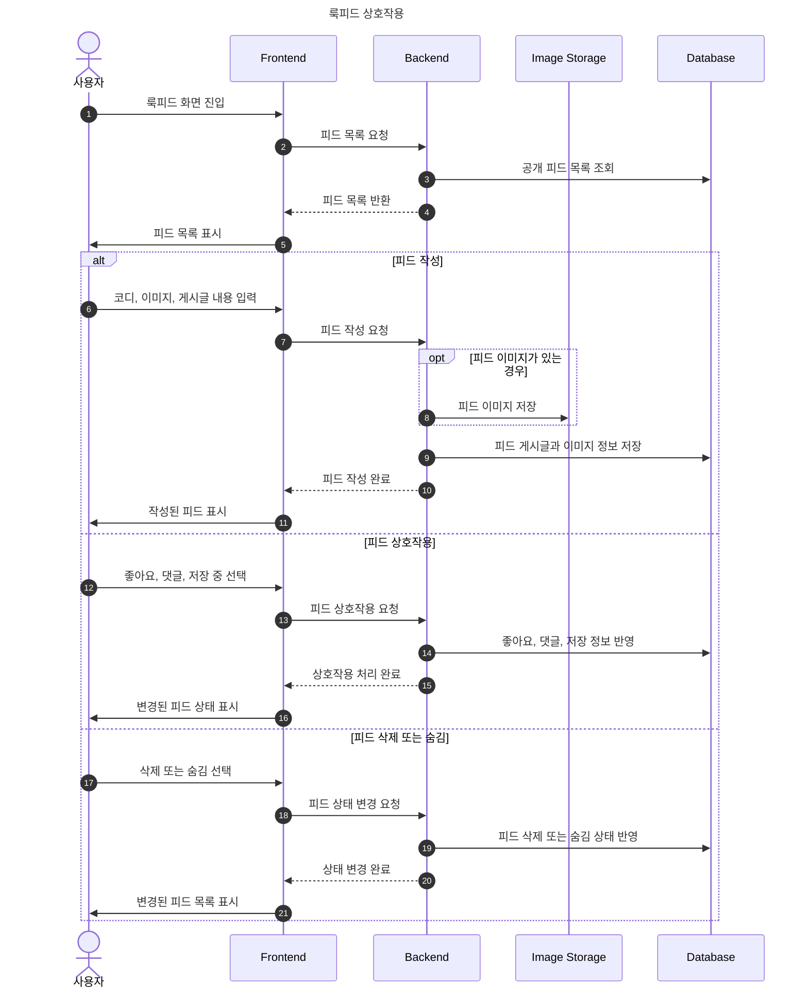

# 시퀀스 다이어그램

이 문서는 옷장난감의 주요 기능 흐름을 시퀀스 다이어그램으로 정리합니다. API 경로는 개발 중 변경될 수 있으므로, 이 문서에서는 경로보다 기능명과 행위명 중심으로 흐름을 설명합니다.

## 문서 기준

- 상세 API 경로와 요청/응답 필드는 [BE API 계약](https://github.com/prgrms-aibe-devcourse/AIBE5_FinalProject_Team4_BE/blob/develop/docs/api/api-contract.md)을 원본으로 보고, FE 호출 기준은 [FE API 사용 기준](../api/frontend-api-usage.md)을 함께 확인합니다.
- 기능 요구와 세부기능 ID는 [요구사항 정의서](../requirements/requirements-definition.md)와 [기능 인덱스](../requirements/feature-index.md)를 따릅니다.
- 데이터 저장 책임은 [BE ERD](https://github.com/prgrms-aibe-devcourse/AIBE5_FinalProject_Team4_BE/blob/develop/docs/database/erd.md)와 [BE 데이터 생명주기](https://github.com/prgrms-aibe-devcourse/AIBE5_FinalProject_Team4_BE/blob/develop/docs/database/data-lifecycle.md)를 따릅니다.
- 시퀀스 다이어그램은 구현 코드를 그대로 나열하는 문서가 아니라, 기능이 어떤 순서로 동작해야 하는지 확인하기 위한 문서입니다.

## 1. 로그인 및 온보딩

## 2. 옷 등록

## 3. 옷장 조회 및 관리

## 4. 추천 및 피드백

## 5. 미보유 옷 보유 전환

## 6. 룩피드 상호작용

## 변경 기준

- 주요 기능 흐름, 사용자 액션, 외부 API 사용 여부가 바뀌면 이 문서를 수정합니다.
- API 경로만 바뀌고 기능 흐름이 같으면 이 문서보다 [BE API 계약](https://github.com/prgrms-aibe-devcourse/AIBE5_FinalProject_Team4_BE/blob/develop/docs/api/api-contract.md)과 [FE API 사용 기준](../api/frontend-api-usage.md)을 우선 수정합니다.
- 코드와 이 흐름이 다르게 동작한다면, 코드가 기준을 따를지 기준 문서를 수정할지 PR에서 명시합니다.
