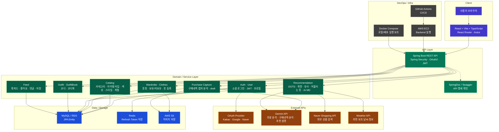

# 시스템 아키텍처

이 문서는 옷장난감 서비스의 전체 시스템 구성을 정리합니다. FE, BE, DB, 외부 API, 이미지 저장소, 인증, 배포 인프라가 어떤 책임으로 연결되는지 이해하기 위한 문서입니다.

## 문서 기준

- 실제 프로젝트에서 사용하는 구성 요소만 포함합니다.
- 현재 프로젝트 기준에 없는 Kafka, WebSocket, GitHub Webhook 기반 서비스는 포함하지 않습니다.
- 세부 BE 패키지 책임은 [BE 패키지 구조](https://github.com/prgrms-aibe-devcourse/AIBE5_FinalProject_Team4_BE/blob/develop/docs/architecture/package-structure.md)를 따릅니다.
- API 경로와 요청/응답 상세는 [BE API 계약](https://github.com/prgrms-aibe-devcourse/AIBE5_FinalProject_Team4_BE/blob/develop/docs/api/api-contract.md)을 원본으로 보고, FE 호출 기준은 [FE API 사용 기준](../api/frontend-api-usage.md)을 함께 확인합니다.
- DB 테이블 책임과 관계는 [BE ERD](https://github.com/prgrms-aibe-devcourse/AIBE5_FinalProject_Team4_BE/blob/develop/docs/database/erd.md)를 따릅니다.

## 구성 요소

| 영역 | 구성 요소 | 역할 |
| --- | --- | --- |
| Client | React, Vite, TypeScript | 사용자 화면, 라우팅, API 호출 |
| API Layer | Spring Boot REST API | 인증, API 요청 처리, 도메인 서비스 호출 |
| API Docs | SpringDoc, Swagger | API 명세 확인 |
| Auth | Spring Security, OAuth2, JWT | 소셜 로그인, 인증 토큰 발급/검증 |
| Token Store | Redis | Refresh Token 저장 |
| Domain | User, Wardrobe, Clothes, Catalog, Recommendation, Outfit, Feed | 핵심 비즈니스 기능 |
| Data | MySQL, RDS, JPA | 서비스 데이터 저장 |
| Image Storage | AWS S3 | 옷 이미지, 피드 이미지 저장 |
| External API | Gemini, Naver Shopping, Weather, OAuth Provider | AI 분석, 외부 상품 검색, 날씨 보조 정보, 소셜 인증 |
| Infra | EC2, Docker Compose, GitHub Actions | 실행 환경, 로컬 인프라, CI/CD |

## 다이어그램

## 변경 기준

- 인증 방식, 토큰 저장소, 외부 API, 이미지 저장소, 배포 인프라가 바뀌면 이 문서를 함께 수정합니다.
- 도메인 패키지나 책임 경계가 바뀌면 [BE 패키지 구조](https://github.com/prgrms-aibe-devcourse/AIBE5_FinalProject_Team4_BE/blob/develop/docs/architecture/package-structure.md)도 함께 확인합니다.
- DB 책임이나 테이블 구조가 바뀌면 [BE ERD](https://github.com/prgrms-aibe-devcourse/AIBE5_FinalProject_Team4_BE/blob/develop/docs/database/erd.md)와 [BE 데이터 생명주기](https://github.com/prgrms-aibe-devcourse/AIBE5_FinalProject_Team4_BE/blob/develop/docs/database/data-lifecycle.md)를 함께 확인합니다.
